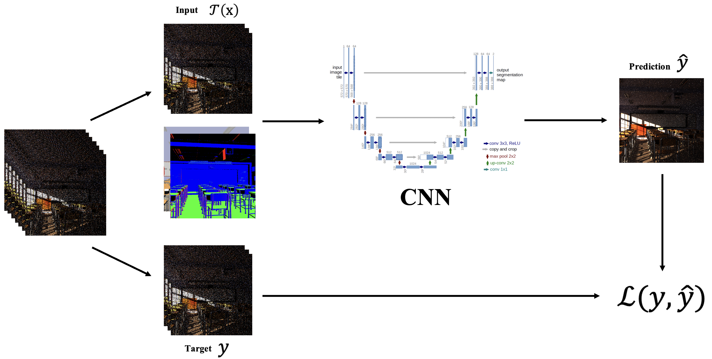
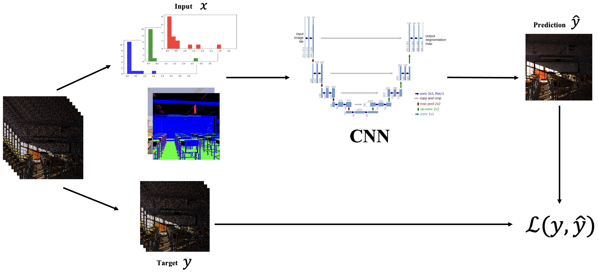
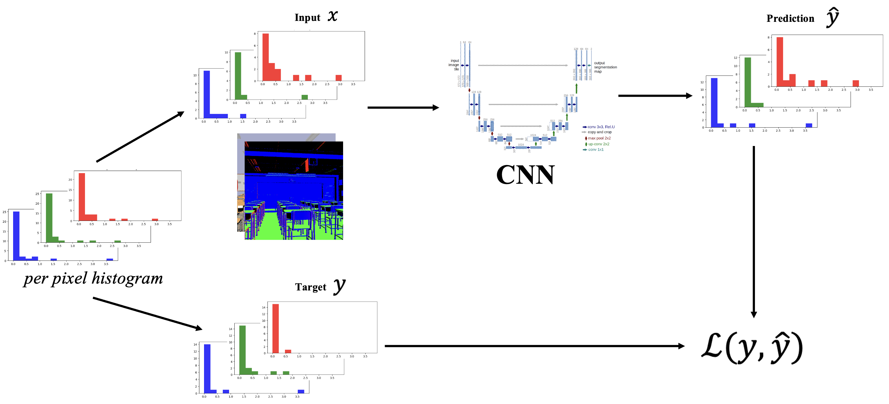

# MCRT Denoising

## Project Structure
```
MCRT/
├── data/
├── dataset/
├── scripts/
├── model/
├── renderer/
├── output/
├── utils/
├── config/
├── launch.py
├── mcrt.yml
```

where: 
- **data**: raw data (_XML_) of the scenes/images to be rendered
- **dataset**: implementation of custom dataloader class to load and process image and histogram data
- **scripts**: jupyter notebooks to render scenes in low/high res (_TIFF_) and generate histograms (_NPZ_)
- **model**: denoising and generative pipelines for the different modes (_Noise2Noise_, _Hist2Noise_, _Hist2Hist_)
- **renderer**: functions used to render noisy and clean images using _Mitsuba3_ (supports both CPU and GPU)
- **output**: folder containing the output (_TIFF_) files
- **utils**: contains utils functions for tone mapping, logging and plotting
- **config**: folder containing the configurations for the various tasks
- **launch.py**: main file to run the project

## Setup
Requirements:
- **Python**: 3.9
- **Anaconda** or **Miniconda**

```bash
# Create the environment from the YAML file
conda env create -f mcrt.yml

# Activate the environment
conda activate mcrt
```

## Modes
### Noise2Noise
- stat: False --> standard noise2noise denoising pipeline. Takes as input the _mean_ of N samples and the corresponding AOVs.
- stat: True --> same approach as above but it concatenates the _relative variance_ to the mean. 

<p align="center">
    
</p>

### Hist2Noise
- stat: False --> input consists of histogram with B bins of N samples and the corresponding AOVs.
- stat: True --> same approach as above but it concatenates the _mean_ and _relative variance_ to the histogram. 

<p align="center">
    
</p>

### Hist2Hist
- stat: False --> input consists of histogram with B bins of N samples and the corresponding AOVs.
- stat: True --> same approach as above but it concatenates the _mean_ and _relative variance_ to the histogram. 

<p align="center">
    
</p>

## How to Run
From project root: 
```bash
python launch.py data_gen                                           # for rendering dataset images
python launch.py data_loader                                        # for testing data loaders
python launch.py train --config config/train_n2n.yml                # for Noise2Noise (IMG mode)
python launch.py train --config config/train_n2n_stat.yml           # for Noise2Noise (STAT mode)
python launch.py train --config config/train_h2n.yml                # for Hist2Noise
python launch.py eval                                               # for Noise2Noise and Hist2Noise inference
python launch.py train_gen --config config/train_h2h.yml            # for Hist2Hist (HIST mode)
python launch.py train_gen --config config/train_h2h_stat.yml       # for Hist2Hist (STAT mode)
python launch.py eval_gen                                           # for Hist2Hist inference
```